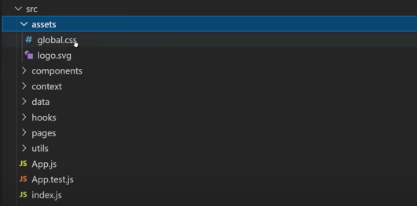
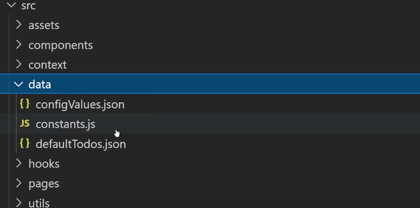
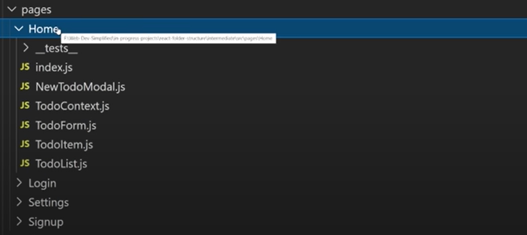
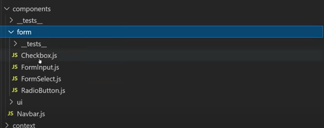
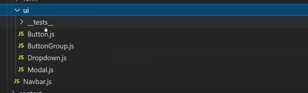
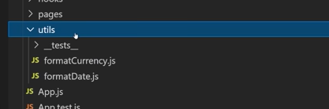

### source 
https://blog.webdevsimplified.com/2022-07/react-folder-structure/

## assets directory

#### This folder contains all images, css files, font files, etc.

## data directory

#### This folder is for data assets such as JSON files that contains information used in our code(store items, theme information, etc). This folder can also store a file that contains global constant varibles such as environment variables etc.

## pages directory

#### This directory should contain one folder for each page. Each folder should contain root file index.js adjacent to the all files that are only applicable to that page. The components in this folder will only be used in that specific page. They won't be used in any other page.

## component directory

#### Here component directory is further broken down into subfolders. For example we "form" folder for form specific controls like checkboxes, inputs, dat picker, etc, "ui" folder which contains all UI components like buttons, modals, cards etc. Components are like general small components. There might be some components they won't even store any state, we just give them data and they render the output to the screen.

## utils directory

#### This folder contains all the utility functios such as formatters. Generally it is used to store pure functions that has no side effects and always return the exact same thing every single time we give it the same input.